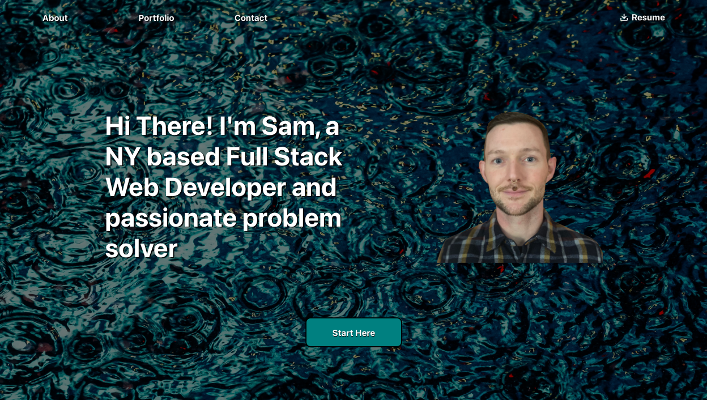

[![GitHub][github-shield]][github-url]
[![LinkedIn][linkedin-shield]][linkedin-url]
[![MIT License][license-shield]][license-url]
[![JavaScript][javascript-shield]][javascript-url] 
[![Contributors][contributors-shield]][contributors-url]
[![Stargazers][stars-shield]][stars-url]
[![Issues][issues-shield]][issues-url]

    
<h1> Portfolio</h1>

 ⛰️&emsp; ⛰️&emsp; ⛰️&emsp;  

 

    Welcome to <strong>My Portofio</strong>! This space will be updated often, as I continue to add applications to my resume and expand my skill set.

    

    
<h2>Table of Contents</h2>

    <ol>
        <li>
            <a href="#getting-started">Getting Started</a>
            <ul>
                <li><a href="#screenshots">Screenshots</a></li>
                <li><a href='#dependencies'>Dependencies</a></li>
            </ul>
        </li>
        <li><a href="#live-site"> Live Site </a></li>
        <li><a href="#license"> License </a></li>
        <li><a href="#contact"> Contact </a></li>
    </ol>

<h1 id='getting-started' align='center'> Getting Started </h1>

 ⛰️&emsp; ⛰️&emsp; ⛰️&emsp;  

<h2 id='screenshots'> ScreenShots </h2>

 ⛰️&emsp; ⛰️&emsp; ⛰️&emsp;  

<h2 id='dependencies'> Dependencies </h2>

<table>
    <tr>
        <th colspan="1"> Front End </th>
    </tr>
    <tr> 
        <td> <a href='https://www.npmjs.com/package/react'> React </a></td> 
    </tr>
    <tr> 
        <td> <a href='https://www.npmjs.com/package/framer-motion'> Framer Motion </a></td>
    </tr>
    <tr> 
        <td> <a href='https://www.npmjs.com/package/react-icons'> React Icons </a></td> 
    </tr>
    <tr> 
        <td> <a href='https://www.npmjs.com/package/react-dom'> React-Dom </a></td>
    </tr>
    <tr> 
        <td> <a href='https://www.npmjs.com/package/react-scripts'> React-Scripts </a></td>
    </tr>
</table>

 ⛰️&emsp; ⛰️&emsp; ⛰️&emsp;  

<h2 id='license'> License </h2>

 Distributed under the MIT License. See <a href='https://github.com/gamgee-em/portfolio/blob/main/LICENSE.txt'> LICENSE.txt </a> for additional information. 

 ⛰️&emsp; ⛰️&emsp; ⛰️&emsp;  

<h2 id='live-site'> Live Site </h2>

<a href='#'> Portfolio </a>

 ⛰️&emsp; ⛰️&emsp; ⛰️&emsp;  

<h2 id='contact'> Contact </h2>

 Email: <a href='mailto: samuel.sweigart@gmail.com'> samuel.sweigart@gmail.com </a> 

 GitHub Profile: <a href='https://github.com/gamgee-em'> Sam Sweigart </a> 

 
    (<a href="#top"> Back to Top</a>) 

[github-shield]: https://img.shields.io/badge/Gamgee--Em-%23121011.svg?style=for-the-badge&logo=github&logoColor=black&colorB=bf7e32
[github-url]: https://github.com/gamgee-em

[javascript-shield]: https://img.shields.io/badge/javascript-Es6-black?style=for-the-badge&logo=javascript&logoColor=pink
[javascript-url]: https://www.w3schools.com/js/js_es6.asp

[contributors-shield]: https://img.shields.io/github/contributors/gamgee-em/portfolio.svg?style=for-the-badge&color=yellow
[contributors-url]: https://github.com/gamgee-em/portfolio/graphs/contributors

[stars-shield]: https://img.shields.io/github/stars/gamgee-em/portfolio.svg?style=for-the-badge&color=ec9198&labelColor=black
[stars-url]: https://github.com/gamgee-em/Tick-List/stargazers

[issues-shield]: https://img.shields.io/github/issues/gamgee-em/portfolio.svg?style=for-the-badge&color=5431a2
[issues-url]: https://github.com/gamgee-em/Tick-List/issues

[license-shield]: https://img.shields.io/github/license/gamgee-em/portfolio.svg?style=for-the-badge&color=ad7dbd
[license-url]: https://github.com/gamgee-em/portfolio/blob/main/LICENSE.txt

[linkedin-shield]: https://img.shields.io/badge/-LinkedIn-black.svg?style=for-the-badge&logo=linkedin&logoColor=black&colorB=blue
[linkedin-url]: https://linkedin.com/in/gamgee-em
